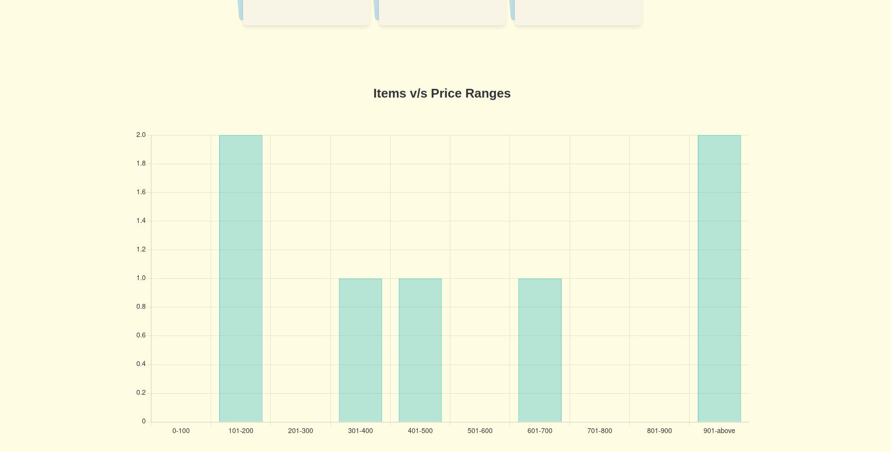

# Product Transactions Dashboard

This project is a React-based Dashboard application for viewing and interacting with product transactions, including listing transactions, displaying statistics, and visualizing data with charts.

## Table of Contents
- [Features](#features)
- [Installation](#installation)
- [Running the Application](#running-the-application)


## Features

- **Transactions Table**: 
  - Displays a list of transactions for the selected month.
  - Search functionality to filter transactions by title, description, or price.
  - Pagination to navigate through transactions.
  - Dropdown to select the month, with March selected by default.

  <br>

  

<br>

- **Statistics**:
  - Shows the total sale amount, total sold items, and total unsold items for the selected month.
  - Displays data in a visually appealing layout.

  <br>

  

<br>

- **Bar Chart**:
  - Visualizes the number of items in different price ranges for the selected month.
  - Uses `Chart.js` for dynamic and responsive charts.

  <br>

  

<br>


## Installation

1. Clone the repository:
    ```sh
   https://github.com/bhav380-2/Product-Transactions-Dashboard.git
    ```

2. Navigate to the project directory:
    ```sh
    cd Product-Transactions-Dashboard
    ```

3. Install dependencies:
    ```sh
    npm install
    ```

## Running the Application

1. Start the development server:
    ```sh
    npm start
    ```

2. The application will be running on `http://localhost:3000`.

